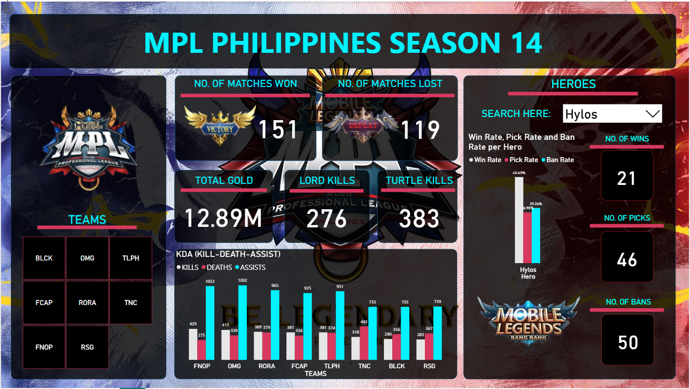

# 🎮 MPL Season 14 Dashboard – Power BI

  

---

## 🏆 Project Overview

This Power BI dashboard visualizes the <b>Mobile Legends: Bang Bang Professional League (MPL) Philippines Season 14</b> performance data, showcasing <b>team standings, hero analytics, KDA ratios, win/loss trends,</b> and <b>objective control</b>. It provides data-driven insights for analysts, teams, and fans to assess competitive performance across the season.

---

## 🔧 Workflow & Data Pipeline
- **🕸️ Data Extraction:**  
  Collected match, team, player, and hero statistics directly from the <b>official MPL website</b> using <b>Python + Beautiful Soup</b>.  
  Extracted raw HTML tables containing match results, hero pick–ban rates, and performance metrics.

- **🧹 Data Standardization:**  
  Cleaned and structured the scraped data in <b>Excel</b>:  
  - Normalized team and hero naming conventions  
  - Converted percentages and counts into numeric data types  
  - Combined multiple pages/tables into a single structured dataset ready for Power BI  

- **📊 Dashboard Development:**  
  Modeled and visualized the data using <b>Power BI</b>, highlighting trends across teams, match objectives, and hero performance.

> ℹ️ <b>Data Snapshot Date:</b> The dataset represents information extracted from the MPL website around <b>late July 2024</b>.  
> This project is a static snapshot and does not include automated data refreshes.

---

## 📌 Key Metrics & Insights
- **🏅 Matches Won & Lost** – Overall team performance comparison  
- **💰 Total Gold Earned** – In-game gold accumulated by teams to buy equipment.  
- **🐉 Objective Control** – Lord and Turtle kills  
- **🎯 KDA (Kill–Death–Assist)** – Team and player efficiency  
- **🧙 Hero Analytics** – Win, Pick, and Ban rates per hero

---

## 🛠️ Tools & Technologies
- **Python (Beautiful Soup)** – Web scraping of MPL statistics  
- **Excel** – Data transformation and cleaning  
- **Power BI** – Data modeling and interactive visualization  
- **Pandas** – Light preprocessing and CSV handling  

---

## 🚀 Impact
- Transformed raw MPL website data into a structured, interactive Power BI dashboard.  
- Simplified complex esports data into accessible visual insights.  
- Enabled quick performance comparisons across teams and heroes.

---

## 📁 Repository Contents
- `README.md` – Project documentation  
- `data-prep/` – Python script, excel templates and standardized CSVs  
- `dashboard/` – Power BI file and dashboard screenshots  
- `assets/` – Visuals, banners, and logos  

---

## 🔗 Dashboard Access
[View Power BI Dashboard ↗](https://app.powerbi.com/view?r=eyJrIjoiN2E2ZDU0MGUtMDBmOS00MDFkLWE3NDEtNGIwOWMwOWZhNmUxIiwidCI6IjRkYTk4NTcxLWRjZWEtNDgzOS04ZmIxLTBiZGQ1ZGM5NjlmOSIsImMiOjEwfQ%3D%3D)

---

## 🖼️ Visual Preview

  

---

## 📥 Resources
- [Excel Data Template](data-prep/MPLS14%20-%20Cleaned.xlsx)  
- [Power BI File (.pbix)](dashboard/MPLS14.pbix)  
- [Python Scraper Script (Beautiful Soup)](data-prep/Data%20Scraping%20with%20Python%20(Beautiful%20Soup).ipynb)

---

## 📎 Data Notes
- Source: Official MPL website (Season 14)  
- Data Type: Static snapshot (non-refreshing)  
- Data Period: Extracted around **late July 2025**  
- Team & Hero Names: Normalized for consistency  

---

  ⚡ <b>Repository:</b> mpl-season14-powerbi-dashboard
    
  

